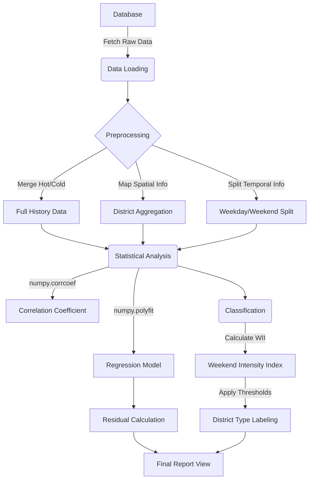

# SeoulBusMap 구현 내용 설명서

## 1. 시스템 개요 (System Overview)

**SeoulBusMap**은 서울시의 행정동별 인구(수요)와 버스 정류장(공급), 그리고 실제 승하차(이용) 데이터를 수집, 저장, 분석하여 시각화하는 웹 기반 아카이빙 플랫폼입니다.

- **Framework:** Django 5.2.7 (Python 3.13)
- **Database:** SQLite3 (Local Development)
- **Architecture:** MTV (Model-Template-View) Pattern

---

## 2. 주요 구현 내용 (Key Implementation)

### 2.1 데이터 모델링 (Data Modeling)

데이터의 최신성과 이력 관리를 동시에 수행하기 위해 **Hot/Cold Storage 전략**을 적용하였습니다.

- **Hot Data (최신 정보):** `HangJeongDong`, `BusStop`, `BusData`
  - 현재 시점의 유효한 데이터만을 유지하며, 빠른 조회 속도를 보장합니다.
- **Cold Data (아카이브):** `*_History` 모델
  - 데이터 변경 시점(`timestamp`)과 보관 시점(`archived_at`)을 기록하여 시계열 분석을 지원합니다.

### 2.2 데이터 수집 파이프라인 (Data Pipeline)

외부 API의 불안정성과 호출 제한을 극복하기 위해 독자적인 수집 명령어를 구현하였습니다.

- **Management Commands:**
  - `fetch_hangjeongdong_data`: 서울시 생활인구 API 연동
  - `fetch_busstop_data`: 카카오맵 API 연동 (위경도 좌표 수집)
  - `fetch_bus_data`: 서울시 버스 승하차 API 연동 (대용량 데이터 처리)
- **Scheduler (`apps.py`):**
  - `threading.Timer`를 활용하여 별도의 인프라 없이 서버 내부에서 주기적(일간/주간/월간)으로 수집 명령어를 실행합니다.

### 2.3 데이터 분석 모듈 (`analysis.py`)

수집된 데이터를 바탕으로 통계적 유의미성을 도출하는 핵심 로직입니다. 이 모듈은 **'수집 -> 전처리 -> 통계 연산 -> 분류'**의 4단계 파이프라인으로 구성됩니다.

#### **1) 분석 로직 흐름 (Logic Flow)**

1.  **데이터 로드 (Data Loading):**
    - DB에서 `HangJeongDong`(인구), `BusStop`(정류장), `BusData`+`BusDataHistory`(승하차) 데이터를 모두 가져옵니다.
    - 특히 승하차 데이터는 Hot/Cold 테이블을 병합하여 전체 기간을 확보합니다.
2.  **전처리 및 집계 (Preprocessing & Aggregation):**
    - **공간 결합:** 정류장별 데이터를 행정동(`district_id`) 기준으로 그룹화(Group By)합니다.
    - **시간 요약:** 날짜별 데이터를 주중/주말(`is_weekend`)로 구분하여 일평균을 계산합니다.
    - **결측 처리:** 데이터가 없는 날짜는 평균 계산에서 제외하고, 최종 결과의 결측치(NaN)는 0으로 채웁니다.
3.  **통계 연산 (Statistical Calculation):**
    - **상관 분석:** 인구수와 정류장 수 간의 피어슨 상관계수($r$)를 계산합니다.
    - **회귀 분석:** `numpy.polyfit`으로 선형 회귀식($Y=aX+b$)을 도출하고, 각 행정동의 예측값($\hat{Y}$)과 잔차($e$)를 계산합니다.
4.  **지구 분류 (Classification):**
    - 주말 집중도 지수($WII$)를 산출합니다.
    - 임계값(0.65, 0.85)을 기준으로 업무/주거/상업 지구로 라벨링합니다.

#### **2) 로직 다이어그램 (Diagram Reference)**

다이어그램 작성을 위한 참고용 구조도입니다.



### 2.4 웹 인터페이스 (Web Interface)

분석 결과를 사용자가 직관적으로 이해할 수 있도록 시각화된 리포트 페이지를 제공합니다.

- **URL:** `/analysis/`
- **View Logic (`views.py`):**
  - 분석 모듈의 결과를 호출하여 템플릿에 전달.
  - 숫자 데이터의 가독성을 위해 천 단위 구분 기호 및 소수점 포맷팅 적용.
- **Template (`analysis_report.html`):**
  - 반응형 디자인을 적용하여 다양한 기기에서 접근 가능.
  - 주요 지표(상관계수, 소외 지역 Top 5 등)를 카드 UI와 테이블 형태로 시각화.

---

## 3. 파일 구조 (File Structure)

```
seoulbusmap/
├── main/
│   ├── models.py       # DB 스키마 정의 (Hot/Cold)
│   ├── views.py        # 뷰 로직 (분석 리포트 포함)
│   ├── analysis.py     # 데이터 분석 및 통계 알고리즘 구현
│   ├── apps.py         # 스케줄러 설정
│   ├── management/     # 데이터 수집 커맨드
│   └── templates/      # HTML 템플릿
├── db.sqlite3          # 데이터베이스 파일
└── manage.py           # Django 관리 스크립트
```
