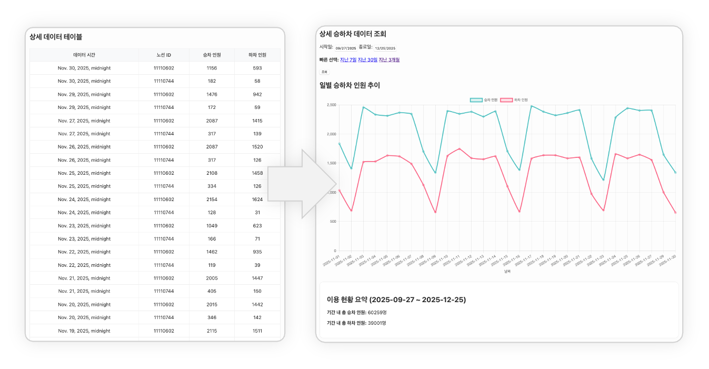
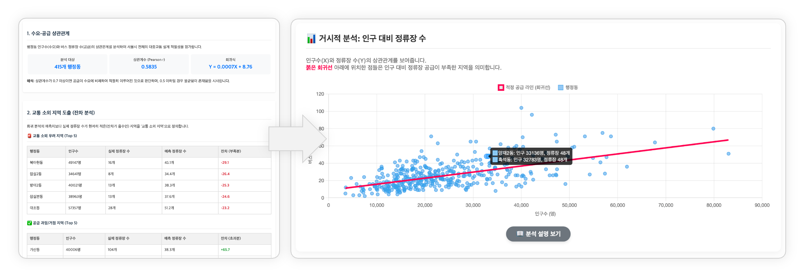
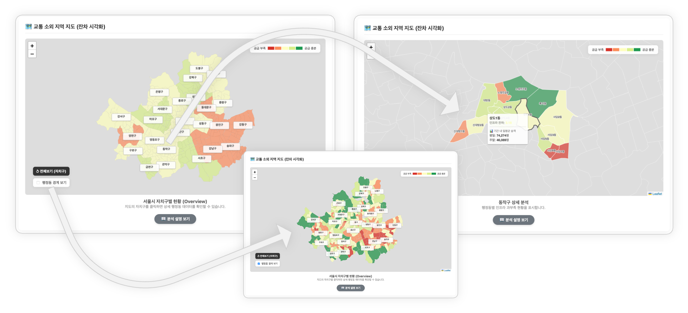
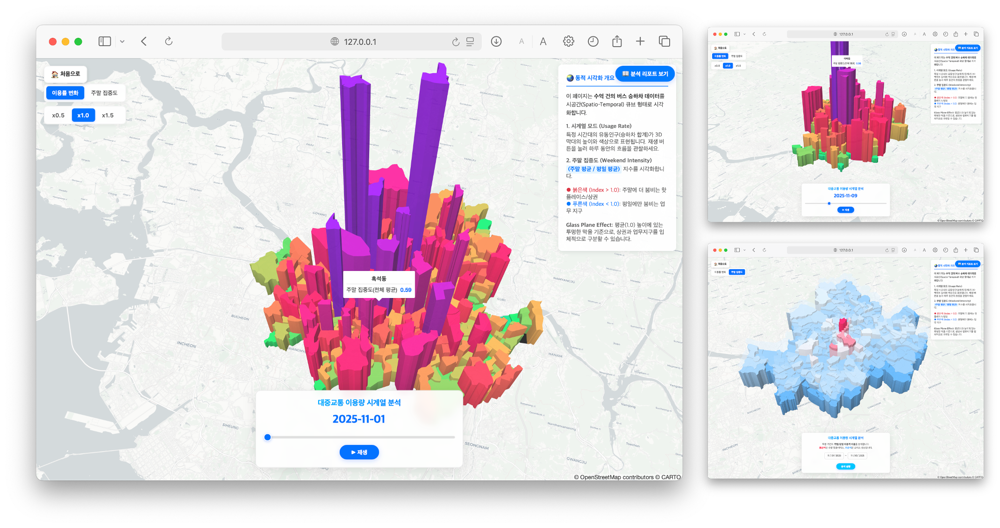

# SeoulBusMap: 서울시 대중교통 소외 지역 분석 및 시각화 아카이브

**SeoulBusMap**은 서울시의 대중교통 소외 지역(Transit Deserts)을 조명하는 데이터 분석 및 시각화 서비스입니다.
실시간 버스 승하차 데이터와 행정동별 인구 데이터를 분석하여, 도시의 **수요-공급 균형**과 **도시 기능(주거/상업)**을 시각적으로 규명합니다.

## 📸 스크린샷 (Screenshots)






## 🚀 주요 기능

- **데이터 아카이빙 (Data Archiving)**: Hot/Cold 데이터베이스 아키텍처를 통해 대용량 버스 데이터를 효율적으로 수집하고 저장합니다.
- **통계 분석 (Statistical Analysis)**:
  - **형평성 분석**: 인구 대비 정류장 수의 회귀 잔차(Residual)를 통해 공급 부족 지역을 도출합니다.
  - **도시 기능 분류**: '주말 집중도 지수(WII)'를 고안하여 각 지역을 업무/주거/상업 지구로 분류합니다.
- **시각화 (Visualization)**:
  - **2D 지도**: 공급/수요 불균형을 색상(Choropleth Map)으로 시각화합니다.
  - **3D 시계열 지도**: 시간 흐름에 따른 유동인구의 변화(Pulse)를 3D로 입체적으로 표현합니다.

## 🛠️ 기술 스택 및 오픈소스 (Tech Stack & Credits)

본 프로젝트는 다음의 오픈소스 기술들을 활용하여 개발되었습니다:

### Backend

- **Django**: 안정적이고 확장 가능한 웹 프레임워크
- **Pandas & NumPy**: 고성능 데이터 분석 및 통계 연산
- **PyKakao**: 카카오 로컬 API 연동
- **Requests**: 데이터 수집을 위한 HTTP 라이브러리

### Frontend & Visualization

- **Leaflet.js**: 모바일 친화적인 인터랙티브 지도 구현
- **MapLibre GL JS**: GPU 가속 기반의 고성능 벡터 3D 지도 렌더링
- **Chart.js**: 통계 데이터 시각화
- **Google Fonts**: 'Noto Sans KR' 폰트 사용

### Data Sources

- **서울 열린데이터광장**: 서울시 버스 승하차 및 정류장 데이터
- **KakaoMap API**: 지오코딩 및 지도 서비스

## 📦 설치 및 실행 가이드 (Installation)

1.  **저장소 클론 (Clone)**

    ```bash
    git clone https://github.com/your-username/seoulbusmap.git
    cd seoulbusmap
    ```

2.  **가상환경 설정 (Virtual Environment)**

    ```bash
    python -m venv venv
    source venv/bin/activate  # Mac/Linux
    # venv\Scripts\activate  # Windows
    ```

3.  **패키지 설치 (Install Dependencies)**

    ```bash
    pip install -r requirements.txt
    ```

4.  **환경 변수 설정 (.env)**

    - 프로젝트 루트에 `.env` 파일을 생성하고 API 키를 입력하세요.
      ```
      SECRET_KEY=your_django_secret_key
      SEOUL_API_KEY=your_seoul_data_key
      KAKAO_API_KEY=your_kakao_map_key
      ```

5.  **데이터베이스 초기화 (Migrate)**

    ```bash
    python manage.py migrate
    ```

6.  **서버 실행 (Run Server)**
    ```bash
    python manage.py runserver
    ```
    브라우저에서 `http://127.0.0.1:8000`으로 접속합니다.

## 🖥️ 관리자 명령어 (Management Commands)

본 프로젝트는 데이터 수집 및 관리를 위한 커스텀 명령어를 제공합니다.

- **데이터 수집**:
  - `python manage.py fetch_hangjeongdong_data`: 행정동 데이터 수집 (최초 1회)
  - `python manage.py fetch_busstop_data`: 버스 정류장 데이터 수집
  - `python manage.py fetch_bus_data`: 실시간 버스 승하차 데이터 수집 (Cron 등으로 주기적 실행 권장)
- **데이터 관리**:
  - `python manage.py bake_analysis_data`: 분석 결과 JSON 파일 생성 (성능 최적화용)
  - `python manage.py delete_bus_data`: 오래된 데이터 삭제
  - `python manage.py vacuum_db`: DB 용량 최적화

_본 프로젝트는 중앙대학교 예술공학대학 예술공학부 [디지털아카이빙과 데이터시각화] 수업의 일환으로 제작되었습니다._
